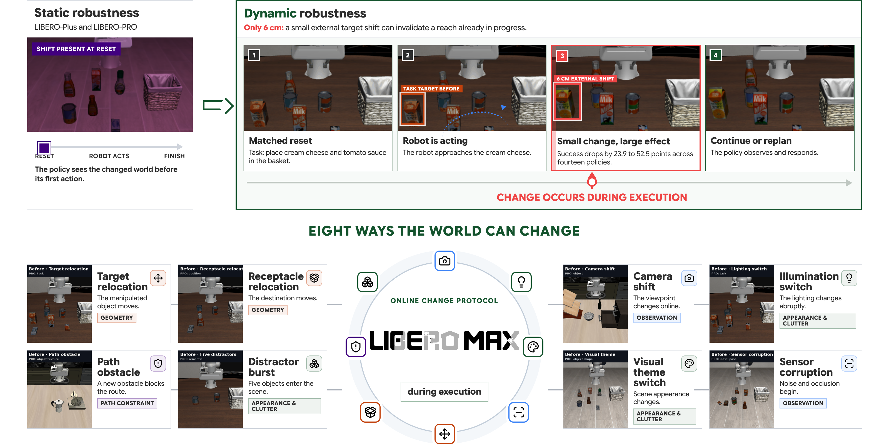
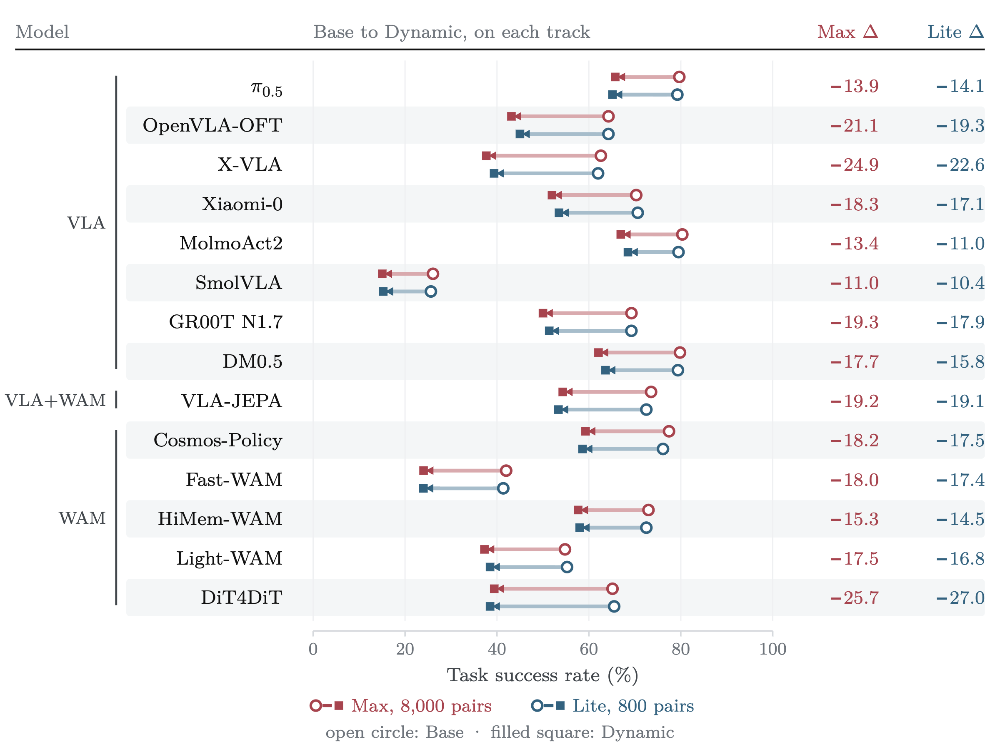
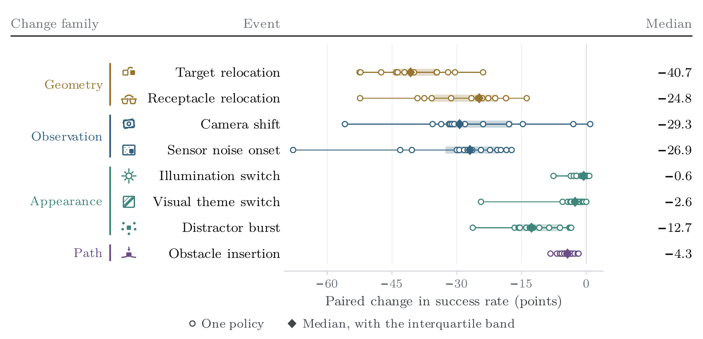

<div align="center">

<h1></h1>

### Do robot policies adapt when the world changes during execution?

[](#citation)
[](benchmark/max8000)
[](benchmark/lite)
[](#results)
[](https://yunbeizhang.github.io/LIBERO-MAX/)
[](https://github.com/yunbeizhang/LIBERO-MAX/actions)

[Dataset](benchmark/max8000) · [LIBERO-MAX Lite](benchmark/lite) · [Benchmark specification](docs/BENCHMARK_SPEC.md) · [Evaluation guide](docs/RUNTIME_INTEGRATION.md)

</div>



LIBERO-MAX measures whether a robot policy preserves task success after an **exogenous change introduced during execution**. Every Dynamic rollout is paired with a no-event Base control that shares the task, reset state, instruction, policy seed, and executed action prefix. The pair differs only when one frozen event is applied to Dynamic, isolating the outcome effect of adding that online change. The benchmark does not infer whether a policy internally detected the event or deliberately replanned.

> **News — 2026-09-07.** The README and project website now include the complete fourteen-policy result table, downloadable counts and rates, and updated figures with the new LIBERO-MAX wordmark.
>
> **News — 2026-09-03.** We expanded the primary comparison to fourteen complete VLA, VLA+WAM, and WAM evaluations and released the fixed 800-pair LIBERO-MAX Lite track.
>
> **News — 2026-08-15.** We released the LIBERO-MAX dataset and the initial complete results across five VLA and WAM policies.
>
> **Coming soon.** Paper PDF and BibTeX.

## LIBERO-MAX and LIBERO-MAX Lite

The repository provides two evaluation scales with the same paired protocol and event taxonomy:

| Benchmark | Coverage | Scored rollouts | Intended use |
|---|---:|---:|---|
| **LIBERO-MAX** | 8,000 matched Base–Dynamic pairs | 16,000 | Primary benchmark reporting |
| **LIBERO-MAX Lite** | 800 fixed matched pairs | 1,600 | Fast integration checks, ablations, and cadence studies |

LIBERO-MAX Lite is a deterministic subset of LIBERO-MAX: 100 pairs per event type, comprising 560 LIBERO-Plus-derived pairs and 240 LIBERO-PRO-derived pairs. It preserves the full benchmark schema, paired controls, event balance, and failure accounting; it is not a separate task distribution. Across fourteen audited policies, Lite estimates every reported Base rate, Dynamic rate, and paired gap within 2.4 percentage points of Max and preserves 88 of 91 pairwise Dynamic orderings. Use LIBERO-MAX for final comparisons and LIBERO-MAX Lite to verify a new policy adapter before committing to the full run.

The eight online changes cover four event families:

- **Geometry:** target relocation and receptacle relocation.
- **Observation:** camera shift and sensor-noise onset.
- **Appearance and clutter:** illumination switch, visual-theme switch, and distractor burst.
- **Path constraint:** obstacle insertion.

### Lineage and acknowledgements

LIBERO-MAX builds on three public foundations. The linked names point to the corresponding papers.

| Foundation | Contribution to LIBERO-MAX |
|---|---|
| [LIBERO](https://arxiv.org/abs/2306.03310) | Task suites, simulation environments, and demonstration corpus |
| [LIBERO-Plus](https://arxiv.org/abs/2510.13626) | Seven controllable static source dimensions used to construct 5,600 pairs |
| [LIBERO-PRO](https://arxiv.org/abs/2510.03827) | Ten semantic, geometric, and visual source categories used to construct 2,400 pairs |

See [ACKNOWLEDGEMENTS.md](ACKNOWLEDGEMENTS.md) for the complete attribution and license notes.

<p align="center">
  
  
  
  
</p>

## Results

### Full benchmark and fast split

Across fourteen complete 8,000-pair evaluations, every policy loses 11.0 to 25.7 success-rate points after the online event. Among episodes solved in Base, 20.8% to 56.1% become failures in Dynamic. The evaluated VLA, VLA+WAM, and WAM policies interleave rather than forming a consistent family ordering.

| Family | Policy | Base SR (%) | Dynamic SR (%) | Δ (pp) |
|---|---|---:|---:|---:|
| VLA | π0.5 | 79.7 | 65.7 | -13.9 |
| VLA | OpenVLA-OFT | 64.3 | 43.2 | -21.1 |
| VLA | X-VLA | 62.6 | 37.7 | -24.9 |
| VLA | Xiaomi-Robotics-0 | 70.3 | 52.0 | -18.3 |
| VLA | MolmoAct2 | 80.3 | 66.9 | -13.4 |
| VLA | SmolVLA | 26.1 | 15.0 | -11.0 |
| VLA | GR00T N1.7 | 69.3 | 50.0 | -19.3 |
| VLA | DM0.5 | 79.8 | 62.1 | -17.7 |
| VLA+WAM | VLA-JEPA | 73.5 | 54.3 | -19.2 |
| WAM | Cosmos-Policy | 77.4 | 59.3 | -18.2 |
| WAM | Fast-WAM | 42.0 | 24.0 | -18.0 |
| WAM | HiMem-WAM | 73.0 | 57.7 | -15.3 |
| WAM | Light-WAM | 54.8 | 37.3 | -17.5 |
| WAM | DiT4DiT | 65.1 | 39.4 | -25.7 |

Each row contains the same 8,000 matched pairs. Δ is Dynamic minus Base, computed from the exact counts before rounding. [Download the counts and rates (CSV)](results/primary_results.csv).

LIBERO-MAX Lite closely tracks the full benchmark, making it useful for rapid adapter validation while leaving LIBERO-MAX as the primary reporting track.



### Where policies lose success

The event-level view reports Dynamic success loss from the matched Base control. Geometry and observation changes produce the largest median losses, with substantial checkpoint-specific variation.



## Supported model adapters

The benchmark runner is model-agnostic: a model adapter receives the frozen case, observes the environment at its native cadence, and emits actions. The repository includes launchers or shard adapters for the following policy integrations.

| Family | Model | Evaluation entry point |
|---|---|---|
| VLA | π0.5 | [`scripts/run_openpi_persistent_benchmark.sh`](scripts/run_openpi_persistent_benchmark.sh) |
| VLA | OpenVLA-OFT | [`scripts/run_openvla_oft_persistent_benchmark.py`](scripts/run_openvla_oft_persistent_benchmark.py) |
| VLA | X-VLA | [`scripts/run_xvla_persistent_benchmark.py`](scripts/run_xvla_persistent_benchmark.py) |
| VLA | LingBot-VA | [`scripts/run_lingbot_persistent_benchmark.py`](scripts/run_lingbot_persistent_benchmark.py) |
| VLA+WAM | VLA-JEPA | [`scripts/run_vlajepa_persistent_benchmark.py`](scripts/run_vlajepa_persistent_benchmark.py) |
| WAM | Cosmos-Policy | [`scripts/run_cosmos_persistent_benchmark.py`](scripts/run_cosmos_persistent_benchmark.py) |
| WAM | Fast-WAM | [`scripts/run_fastwam_persistent_benchmark.py`](scripts/run_fastwam_persistent_benchmark.py) |

The primary fourteen-policy paper evaluation additionally includes Xiaomi-Robotics-0, MolmoAct2, SmolVLA, GR00T N1.7, DM0.5, HiMem-WAM, Light-WAM, and DiT4DiT. Their model-side adapters are not redistributed in this repository. The LingBot-VA launcher is a compatible reference integration but is not a primary paper row. Each public launcher expects the corresponding upstream checkpoint and environment; the benchmark manifests and scoring protocol are shared across models.

## Quick start

### 1. Install and validate the release

```bash
git clone https://github.com/yunbeizhang/LIBERO-MAX.git
cd LIBERO-MAX
python -m pip install -e .

# Validate the full 8,000-pair release and the fixed 800-pair split.
make validate-max8000
make validate-lite
make test
```

### 2. Test a model on LIBERO-MAX Lite

The example below uses X-VLA. Replace the adapter-specific arguments with those required by the model you are evaluating.

```bash
python scripts/run_dynamic_benchmark.py \
  benchmark/lite/libero_max_lite.json \
  --runner scripts/run_xvla_persistent_shard.py \
  --output-root artifacts/xvla-libero-max-lite \
  -- \
  --lerobot-root /path/to/lerobot \
  --checkpoint /path/to/xvla/checkpoint \
  --query-interval 30
```

This schedules all 800 pairs across every visible GPU with dynamic work stealing. Restrict devices when needed with `--gpus 0,2`.

### 3. Run the same adapter on LIBERO-MAX

```bash
python scripts/run_dynamic_benchmark.py \
  benchmark/max8000/libero_max_8000.json \
  --runner scripts/run_xvla_persistent_shard.py \
  --output-root artifacts/xvla-libero-max \
  -- \
  --lerobot-root /path/to/lerobot \
  --checkpoint /path/to/xvla/checkpoint \
  --query-interval 30
```

Keep the checkpoint and its native inference configuration fixed between the two scales. Each case ends in `DONE` or `FAILED`; failures remain in the denominator, and a complete run must account for all 800 or 8,000 matched pairs.

For custom adapters, follow the common shard interface in the [runtime integration guide](docs/RUNTIME_INTEGRATION.md); [`scripts/run_xvla_persistent_shard.py`](scripts/run_xvla_persistent_shard.py) is a complete reference implementation.

## Repository structure

```text
LIBERO-MAX/
├── benchmark/
│   ├── max8000/              # Full 8,000-pair release and checksums
│   └── lite/                 # Fixed 800-pair subset and validation metadata
├── schemas/                 # Manifest, scenario, and result schemas
├── results/                 # Audited primary counts and success rates
├── src/libero_max/           # Validation, pairing, events, and evaluation utilities
├── scripts/                  # Release builders, schedulers, and model adapters
├── examples/                 # Minimal policy integration
├── tests/                    # Protocol, release, and launcher checks
├── docs/                     # Benchmark specification and evaluation guide
├── assets/figures/           # Figures rendered in this README
└── index.html                # Project website
```

## Citation

The paper PDF and BibTeX will be added after release. For now, please cite the repository URL:

```text
https://github.com/yunbeizhang/LIBERO-MAX
```
